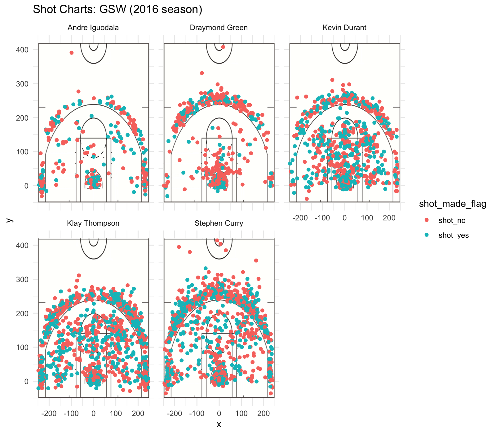

warmup01-edmund-tian.Rmd
================

**Introduction**

This current Golden State Warriors team is arguably one of the greatest teams in NBA history. At the same time, the argument could be made that they are breaking the game. A once beautiful game that involved intricate plays now consists of players dribbling up to the three point line and jacking up shots. GSW is the most successful shooting team in NBA history and the results have shown. Teams all over the league and around world emulate their strategy of jacking up shots in an attempt to achieve the same success that GSW has. Unfortunately, many of these teams simply don't have good enough shooters to make that work. Let's look at this graphic showing the shot chart for GSW's 5 best players.



We can see that GSW has three **extremely** good shooters in Steph Curry, Klay Thompson, and Kevin Durant. Although this chart is a great visual for giving us an idea for how good of shooters, it's a little bit too messy to compare the players on a more fine level.

Let's take a look at their shooting percentages (2pt, 3pt, and overall).

We can see that Andre Iguodala has the best 2pt percentage. This makes sense as most of his scores are made near the basket.

``` r
twos
```

    ## # A tibble: 5 x 2
    ##   name           percentage
    ##   <chr>               <dbl>
    ## 1 Andre Iguodala      0.638
    ## 2 Kevin Durant        0.607
    ## 3 Stephen Curry       0.540
    ## 4 Klay Thompson       0.514
    ## 5 Draymond Green      0.494

In terms of three, the best shooters, as expected are Klay, Steph, and KD.

``` r
threes
```

    ## # A tibble: 5 x 2
    ##   name           percentage
    ##   <chr>               <dbl>
    ## 1 Klay Thompson       0.424
    ## 2 Stephen Curry       0.408
    ## 3 Kevin Durant        0.386
    ## 4 Andre Iguodala      0.360
    ## 5 Draymond Green      0.319

Overall, the best shooter is KD. This is expected as KD is one of the best pure scorers in NBA history. With his crazy length and great handles, he's able to easily create good shots for himself.

``` r
overall
```

    ## # A tibble: 5 x 2
    ##   name           percentage
    ##   <chr>               <dbl>
    ## 1 Kevin Durant        0.541
    ## 2 Andre Iguodala      0.518
    ## 3 Klay Thompson       0.471
    ## 4 Stephen Curry       0.467
    ## 5 Draymond Green      0.424

Overall, GSW is dominating the league and will continue for years to come. They were already a historic team before KD. With the addition of KD, their best overall shooter, they've become literally unstoppable and will continue to steam roll their way through multiple titles.
